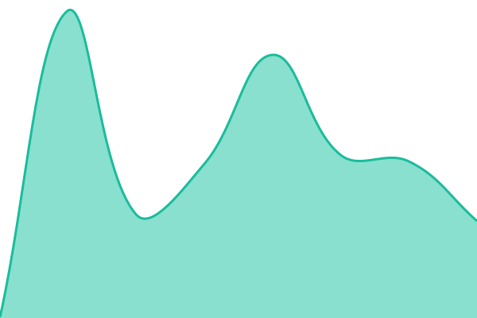

# [📈 Live Status](https://cdowebcast.github.io/status): <!--live status--> **🟧 Partial outage**

This repository contains the open-source uptime monitor and status page for [CDOWEBCAST](http://cdowebcast.com), powered by [Upptime](https://github.com/upptime/upptime).

With [Upptime](https://upptime.js.org), you can get your own unlimited and free uptime monitor and status page, powered entirely by a GitHub repository. We use [Issues](https://github.com/cdowebcast/status/issues) as incident reports, [Actions](https://github.com/cdowebcast/status/actions) as uptime monitors, and [Pages](https://cdowebcast.github.io/status) for the status page.

<!--start: status pages-->
<!-- This summary is generated by Upptime (https://github.com/upptime/upptime) -->
<!-- Do not edit this manually, your changes will be overwritten -->
<!-- prettier-ignore -->
| URL | Status | History | Response Time | Uptime |
| --- | ------ | ------- | ------------- | ------ |
|  [cdowebcast.com.br](https://www.cdowebcast.com.br) | 🟩 Up | [cdowebcast-com-br.yml](https://github.com/cdowebcast/status/commits/HEAD/history/cdowebcast-com-br.yml) | 

 1503ms
     
 | 

<a href="https://status.cdowebcast.com/history/cdowebcast-com-br">100.00%</a>
    

|  [cdowebcast.com](https://www.cdowebcast.com) | 🟩 Up | [cdowebcast-com.yml](https://github.com/cdowebcast/status/commits/HEAD/history/cdowebcast-com.yml) | 

 1236ms
     
 | 

<a href="https://status.cdowebcast.com/history/cdowebcast-com">100.00%</a>
    

|  [voxstream.com.br](https://voxstream.com.br) | 🟩 Up | [voxstream-com-br.yml](https://github.com/cdowebcast/status/commits/HEAD/history/voxstream-com-br.yml) | 

 1206ms
     
 | 

<a href="https://status.cdowebcast.com/history/voxstream-com-br">100.00%</a>
    

|  [voxstreaming.com.br](https://voxstreaming.com.br) | 🟩 Up | [voxstreaming-com-br.yml](https://github.com/cdowebcast/status/commits/HEAD/history/voxstreaming-com-br.yml) | 

 748ms
     
 | 

<a href="https://status.cdowebcast.com/history/voxstreaming-com-br">100.00%</a>
    

|  [voxcast.com.br](https://voxcast.com.br) | 🟩 Up | [voxcast-com-br.yml](https://github.com/cdowebcast/status/commits/HEAD/history/voxcast-com-br.yml) | 

 235ms
     
 | 

<a href="https://status.cdowebcast.com/history/voxcast-com-br">100.00%</a>
    

|  [voxhost.com.br](https://voxhost.com.br) | 🟩 Up | [voxhost-com-br.yml](https://github.com/cdowebcast/status/commits/HEAD/history/voxhost-com-br.yml) | 

 588ms
     
 | 

<a href="https://status.cdowebcast.com/history/voxhost-com-br">100.00%</a>
    

|  [radiobr.net](https://radiobr.net) | 🟥 Down | [radiobr-net.yml](https://github.com/cdowebcast/status/commits/HEAD/history/radiobr-net.yml) | 

 0ms
     
 | 

<a href="https://status.cdowebcast.com/history/radiobr-net">0.00%</a>
    

<!--end: status pages-->

[**Visit our status website →**](https://cdowebcast.github.io/status)

## 📄 License

- Powered by: [Upptime](https://github.com/upptime/upptime)
- Code: [MIT](./LICENSE) © [Anand Chowdhary](https://anandchowdhary.com), supported by [Pabio](https://pabio.com)
- Data in the `./history` directory: [Open Database License](https://opendatacommons.org/licenses/odbl/1-0/)
